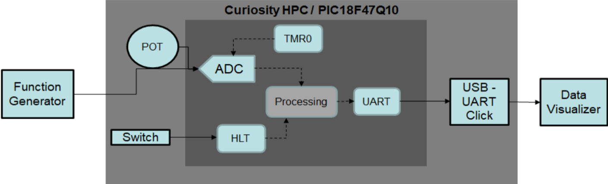

<!-- Please do not change this logo with link -->

# Usage of PIC18-Q10 Family 10-bit ADCC Computation modes for Real-Time Sensing Applications

The PIC18-Q10 family of devices are equipped with a 10-bit ADC with Computation (ADCC) automating Capacitive Voltage Divider (CVD) techniques for advanced touch sensing, averaging, filtering, oversampling and performing automatic threshold comparisons.

### Demonstration Video

 

## Software Used

- [ MPLAB® X IDE 6.15 ](https://www.microchip.com/mplab/mplab-x-ide) or newer
- [Microchip XC8 Compiler 2.46 ](https://www.microchip.com/mplab/compilers) or newer
- [MPLAB® Code Configurator (MCC) 5.3.7 ](https://www.microchip.com/mplab/mplab-code-configurator) or newer
- [Microchip PIC18F-Q Series Device Support Pack v1.24.430](https://packs.download.microchip.com/#collapse-Microchip-PIC18F-Q-DFP-pdsc) or newer
- [Atmel Data Visualizer v2.20.674](https://www.microchip.com/mplab/avr-support/data-visualizer) or newer

## Hardware Used

* [Curiosity High Pin Count (HPC) Development Board](https://www.microchip.com/Developmenttools/ProductDetails/DM164136)
* [Analog Discovery (USB oscilloscope and logic analyzer)](https://reference.digilentinc.com/reference/instrumentation/analog-discovery/start)
* USB Cable  
* [USB UART Click](https://www.mikroe.com/usb-uart-click)

*NOTE: USB UART Click is not needed if Curiosity High Pin Count(HPC) development board of Revision 2 or more is used since the on-board debugger of Curiosity HPC development board has a virtual COM port.*

## Features of ADCC

* Thirty-five external channels and four internal analog channels
* Conversion available during Sleep, if Fast RC Oscillator (FRC) clock is used
* Auto-conversion trigger
  * Internal and external trigger options
* Interrupts upon completion of a conversion or threshold comparison
* Automated math functions on input signals, integrated in the hardware
  * Averaging, filter calculations, oversampling and threshold comparison

These MCUs also contain the Hardware Limit Timer (HLT), which is the enhanced version of timer2 with asynchronous operation and reset, start or stop capability from external/internal signal sources. The HLT operates in various modes such as One-Shot, Monostable, Rollover Pulse mode, etc.

## Description

The PIC18F47Q10 MCU is used in this demo along with curiosity HPC board and USB-UART click board. This demo demonstrates the usage of ADCC module with different computation modes such as basic, average, burst average and Low-Pass Filter mode for sensing applications.

- The Basic mode is considered as a ‘legacy' mode since it does not use the computation features like a typical ADC module available in many PIC16 and PIC18 devices.

- In Average mode, the ADCC module accumulates one sample for each auto-conversion trigger. Depending on the ADRPT value, the ADCC module accumulates a certain number of samples and computes average of the accumulated value

- In Burst Average mode, the ADCC module accumulates a certain number of samples, depending on the ADRPT value, sequentially at a single stretch for each auto-conversion trigger and computes average of the accumulated value.

- The Low-Pass Filter mode filters unwanted frequencies from the input signal. In Low-Pass Filter mode, the ADCC allows the signals whose frequencies are below the cut-off frequency and attenuate signals with frequencies above the cut-off frequency.

After the ADC completes the conversions and computations, the computed data is sent to data visualizer tool over the USB-UART bridge. Using the Data Visualizer, the users can visualize ADC data either on the terminal window or oscilloscope window.

The computation modes of ADC module are user selectable and change when a switch press event is detected. The HLT module of the MCU is a Core Independent Peripheral (CIP) which implements a switch de-bounce mechanism. The switch de-bounce mechanism with HLT module functions without the need of a code implementation other than setting up the module using MPLAB® Code Configurator (MCC).

## Data Acquisition using ADCC

The figure below shows the block diagram of this demo application.

 
  <strong>Block Diagram - Data Acquisition Using ADCC</strong> 

The Curiosity High Pin Count (HPC) development board has got a potentiometer and is connected to analog input (RA0). The potentiometer generates input signal for the ADCC module in basic, average, and burst-average computation modes. For Low-Pass Filter mode, a function generator is required to generate input signal on the analog input (RA1).

After power-up, the ADCC operates in basic mode by default. The board's S2 switch is used to select an appropriate ADC Computation mode, and LEDs D2 and D3 are used to indicate the ADCC computation mode. The table below shows the state of LEDs when a specific computation mode is selected.

<table>
<thead>
<tr>
<th>Computation Mode</th>
<th>LED D3</th>
<th>LED D2</th>
</tr>
</thead>
<tbody>
<tr>
<td>Basic</td>
<td>OFF</td>
<td>OFF</td>
</tr>
<tr>
<td>Average</td>
<td>OFF</td>
<td>ON</td>
</tr>
<tr>
<td>Burst Average</td>
<td>ON</td>
<td>OFF</td>
</tr>
<tr>
<td>Low-Pass Filter</td>
<td>ON</td>
<td>ON</td>
</tr>
</tbody>
</table>

The ADCC module of PIC18F47Q10 MCU periodically acquires analog data and process it to equivalent digital data. The timer0 module acts as a source of trigger to initiate the ADC auto-conversion. The interval for the timer can vary to achieve different ADC sampling frequencies. In case of basic, average and burst-average modes, the sampling frequency is set to 100 Hz. Whereas in case of Low-Pass Filter mode, the interval is selected to 1msec to generate a sampling frequency of 1 kHz.

In Low-Pass Filter mode, cut-off frequency is calculated as below:

 

Where,

T is the sampling frequency
radian value @ -3 dB is chosen according to the below table

<table>
<thead>
<tr>
<th>ADCRS</th>
<th>ωT (radians) @ -3 dB Frequency</th>
<th>dB @ Fnyquist = 1/(2T)</th>
</tr>
</thead>
<tbody>
<tr>
<td>1</td>
<td>0.72</td>
<td>-9.5</td>
</tr>
<tr>
<td>2</td>
<td>0.284</td>
<td>-16.9</td>
</tr>
<tr>
<td>3</td>
<td>0.134</td>
<td>-23.5</td>
</tr>
<tr>
<td>4</td>
<td>0.065</td>
<td>-29.8</td>
</tr>
<tr>
<td>5</td>
<td>0.032</td>
<td>-36.0</td>
</tr>
<tr>
<td>6</td>
<td>0.016</td>
<td>-42.0</td>
</tr>
<tr>
<td>7</td>
<td>0.0078</td>
<td>-48.1</td>
</tr>
</tbody>
</table>

In the demo, configured timer period T = 1ms and ADCRS = 3.
Therefore, f(cutoff) = 0.134 / (2 * π * 1ms) = 21.3 Hz.

On the Curiosity HPC board, the switch S2 is connected to pin RC5 of the MCU and the switch is of type momentary SPST. De-bouncing mechanism is required to detect the valid switch activation/press event. The switch de-bounce mechanism eliminates the spurious state changes on the pin RC5 (connected to switch) due to electrical noise. The HLT module (timer4) is configured with a periodicity of 10ms for the de-bounce mechanism.

The switch de-bounce mechanism is applicable for both the switch press and release events. The pin RC5 state transitions from High-to-Low when the switch is pressed and Low-to-High when the switch is released. The HLT module gets activated after detection of either High-to-Low or Low-to-High transition on the pin. After the 10ms period is elapsed, the HLT module generates an output pulse. Upon detection of one cycle of switch press and release events, the firmware checks for pin RC5 state high and then changes the ADC operating mode.

In all the computation modes, the ADCC’s conversion results are transmitted to data visualizer tool over the UART interface and using the USB-to-UART Click board. The data visualizer tool is useful to analyze the ADCC data.
## Data Visualizer Configuration

 Pre-configured data streamer file is available with the firmware package. The below steps given for data visualizer configuration use these files to prepare the setup.

* Configure the serial port for communication with the Curiosity High Pin Count (HPC) Development Board.
* Set the baud rate to 115200, parity to none and stop bits to 1.
* Ensure the DTR option is checked and both RTS and Open Terminal options are unchecked.

  
   <strong>Serial Port Control Panel</strong> 

* Configure data streamer for interfacing Oscilloscope window with the serial port control panel. Data streamer configuration **(data-streamer-config.txt)** file is available in example firmware folder.

  
   <strong>Data Stream Control Panel</strong> 

* After loading the data-streamer-config.txt file, the Data Streamer window appears as shown below.

  
   <strong>Data Stream Control Panel</strong> 

* Configure Oscilloscope module for visualizing the data values in real-time.

  
   <strong>Oscilloscope Panel</strong> 

  *NOTE: Refer [Data Visualizer user guide](http://www.microchip.com/DS40001903) for more information.*

## Demonstration Setup

* Insert PIC18F47Q10 microcontroller in the microcontroller slot of Curiosity High Pin Count (HPC) Development Board.
* Insert USB UART Click in the mikroBUS slot (Slot 1) available on Curiosity High Pin Count (HPC) Development Board.
* Connect the Curiosity High Pin Count (HPC) Development Board to a host computer (PC) using standard micro B USB cable for power up the board.
* Connect the USB UART click board to a host computer (PC) using standard micro B USB cable for transmit UART data on terminal.  
* Connect function generator’s output to pin RA1 (on header J8) of curiosity HPC board. Establish common ground reference for both function generator and curiosity HPC board.
* The following table shows port pins of PIC18F47Q10 MCU configured in this application along with its respective signal names

<table>
<thead>
<tr>
<th>SL. No.</th>
<th>PIC18F47Q10</th>
<th>Signal</th>
<th>Board</th>
</tr>
</thead>
<tbody>
<tr>
<td>1</td>
<td>RA0/AN0</td>
<td>Potentiometer</td>
<td>Curiosity HPC Board</td>
</tr>
<tr>
<td>2</td>
<td>RA1/AN1</td>
<td>Analog Input</td>
<td>Curiosity HPC Board</td>
</tr>
<tr>
<td>3</td>
<td>RA4</td>
<td>LED D2</td>
<td>Curiosity HPC Board</td>
</tr>
<tr>
<td>4</td>
<td>RA5</td>
<td>LED D3</td>
<td>Curiosity HPC Board</td>
</tr>
<tr>
<td>5</td>
<td>RC5</td>
<td>Switch S2</td>
<td>Curiosity HPC Board</td>
</tr>
<tr>
<td>6</td>
<td>RC6/TX</td>
<td>UART TX</td>
<td>USB UART Click</td>
</tr>
<tr>
<td>7</td>
<td>RC7/RX</td>
<td>UART RX</td>
<td>USB UART Click</td>
</tr>
</tbody>
</table>

 
  <strong>Hardware Setup</strong> 

## Operation

* Connect the hardware and prepare demonstrator setup as per the instructions provided in Demonstration setup section.
* Configure Data Visualizer as per the instructions provided in Data Visualizer Configuration section.
* Click Serial Port Control Panel Connect button.

 

* Using push button (SW0) on the Curiosity High Pin Count (HPC) Development Board to select appropriate ADC Computation mode.
* Use on-board potentiometer for adjusting the ADC input for demonstration.
* Open the terminal window of Data Visualizer and observe the conversion data on terminal window.
* By default, the ADCC is configured in basic mode. No computational feature is enabled and the raw data is displayed in the terminal window.

  

* Press switch (S2) on the board, the ADCC mode changes from basic to average mode. In average mode, the ADCC module is configured to accumulate 16 samples and the averaged value present in the ADFLTR register is displayed on the terminal window. In this mode, setpoint is set at 511, upper threshold to +200 and lower threshold to -200. So, when the ADC value goes below 311 (511-200) or when it goes above 711 (511+200), corresponding error message is displayed.

  

  

  

* Press switch (S2), the ADCC mode switches from average to burst average mode. In burst average mode, the ADCC module is configured to accumulate 16 samples sequentially (at a single stretch) for each auto conversion trigger. The averaged value of accumulated samples (present in ADFLTR register) is displayed on the terminal window. The setpoint, upper threshold and lower threshold are same as in average mode.

  

  

  

  

* Press switch (S2), the ADCC module switches from burst average mode to Low-Pass Filter mode.
 Select serial port, data streamer and oscilloscope options from the configuration tab of the data visualizer as shown.

 

* #### Configuring Data Streamer and Oscilloscope:
   * Select the Data Stream Configuration File and load the file. The file is available in firmware folder.
   * ADC result (ADRES) and ADC filter values (ADFLTR) are outputted
   * Connect ADRES to channel 1 and ADFLTR to channel 2 of the oscilloscope

 

- In Low-Pass Filter mode, generate input signal using the function generator. The input is a DC signal with 2.5 V offset, noise frequency of 100 Hz and amplitude of 200 mV (peak-peak).

 

- The ADCC attenuates the high frequency noise and allows only the DC signal, as shown below. (deltaY of 40.84 = 200 mV)

 

- With 100 Hz noise frequency, the amplitude of the noise in the output signal has reduced to 41.6 mV (peak-peak). The gain has reduced to -13.63 dB. (20 log ((8.521 * 5 / 1024)/200 mV ))

 

- With 210 Hz noise frequency (10 times the cut off frequency), the amplitude of the noise in the output signal has reduced to 18.5 mV (peak-peak). The gain has reduced to -20.6 dB.(20 log ((3.803 * 5 / 1024)/200 mV ))

 

- In the above diagrams, the waveform in yellow is the raw ADRES value and waveform in green is the filtered value. Increasing the CRS value will further attenuate the AC component from the signal.

## Peripheral Configuration
This section explains how to configure the peripherals using MPLAB X IDE with MCC plugin for recreation of the project.

Refer [Software Used section](#software-used) to install required tools to recreate the project.

Additional Links: [MCC Melody Technical Reference](https://onlinedocs.microchip.com/v2/keyword-lookup?keyword=MCC.MELODY.INTRODUCTION&version=latest&redirect=true)

| Peripheral                                    | Configuration                    | Usage                                |
|-----------------------------------------------|----------------------------------|--------------------------------------|
| Clock Control |  Clock Source - HFINTOSC    HF internal clock - 64 MHz   clock divider - 1 | system clock
| Timer 0 | Hardware Settings :  *Enable Timer  Clock Source -Fosc/4  prescaler - 1:8192  postscaler - 1:1  Timer Mode - 8-bit  Requested Period - 10 ms*   | Trigger ADC conversion |
|Timer 4 (HLT) | Hardware Settings :   *Enable Timer   Control mode - Monostable   External Reset Source - T4INPPS pin   Start/Reset Option - Starts on rising edge on TMR4_ers *   Timer Clock :  *Clock Source - LFINTOSC  Prescaler - 1:2   Postscaler - 1:1  *  Interrupt Settings :  *Enable TMR interrupt*    Timer Period : *Timer Period - 10 ms*  | Switch de-bounce |
|UART1| **UART1 DRIVER**  Dependency Selector: EUSART 1   Configuration Settings :  *Requested Baud Rate : 115200  Enable Redirect printf to UART*   Interrupt Settings:  *Enable Interrupt Driven   Software Transmit Buffer Size - 8  Software Receive Buffer Size - 8*  **EUSART1 PLIB**   Enable Receive  Enable Transmit | Send data to Data visualizer|
|Pins | **Pin Grid View**   ADCC   *ANx Input - RA0 , RA1*   EUSART1   *RX1 - RC7   TX1 - RC6   * TMR4   *T4IN input - RC5*   Pins (GPIO)  *output:   - RA4  - RA5*    **Pins**    *RA0   Custom Name - POT_DATA   RA1   Custom Name - FG_DATA   RA4   Custom Name - LED_D2  RA0   Custom Name - LED_D3    RC5   Custom Name - SW2  RC6   Custom Name - UART_TX  RC5   Custom Name - UART_RX  *|  
| ADCC | Refer below table for ADCC configuration|     |

### ADCC Configuration

| Configuration                    | Usage                                |
|----------------------------------|--------------------------------------|
| (Below settings are common for all modes) Enable ADC ADC Clock:   *Clock Source - FOSC   Clock Divider - FOSC/64*  Interrupt Settings:  *Enable ADC Threshold Interrupt*  **BASIC MODE**    Hardware Settings: *Operating Mode - Basic mode  Result Alignment - Right  Positive Reference - VDD  Negative Reference - VSS  Auto Conversion Trigger - TMR0*  **AVERAGE MODE AND BURST AVERAGE MODE**   Hardware Settings: *Operating Mode - Average mode/Burst Average mode  Result Alignment - Right  Positive Reference - VDD  Negative Reference - VSS  Auto Conversion Trigger - TMR0*  Computation Feature:  *Error Calculation- Actual result Vs Setpoint<bbr> Setpoint - 511  Threshold Interrupt - ADERR>ADLTH and ADERR<ADUTH   Lower Threshold - -200  Upper Threshold - 200  Repeat - 16  ACC Right Shift - 4*  **LOW PASS FILTER**   Hardware Settings: *Operating Mode - Basic mode*  Computation Feature: *ACC Right Shift - 3*| Computation modes of ADC|

## Conclusion

The demo provides a code example, which demonstrates the usage of PIC18-Q10 MCUs ADCC module and its advanced computation modes. The advanced ADCC module replaces common firmware tasks for average and filtering implementation with the hardware solution and completely avoids the firmware overhead. It performs advanced computations and filtering of data in hardware without any intervention of CPU, therefore reduces design efforts and improves system response.
