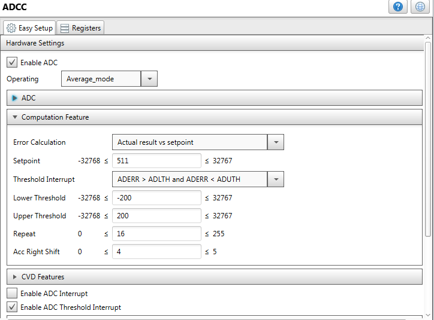

<!-- Please do not change this logo with link -->

# Usage of PIC18-Q10 family 10-bit ADCC Computation modes for real-time sensing applications

The PIC18-Q10 family of devices are equipped with a 10-bit ADC with Computation (ADCC) automating Capacitive Voltage Divider (CVD) techniques for advanced touch sensing, averaging, filtering, oversampling and performing automatic threshold comparisons.

### Demonstration Video 

### Features of ADCC 

* Thirty-five external channels and four internal analog channels
* Conversion available during sleep, if FRC clock is used
* Auto conversion trigger
  * Internal and external trigger options
* Interrupts upon completion of a conversion or threshold comparison
* Automated math functions on input signals, integrated in the hardware
  * Averaging, filter calculations, oversampling and threshold comparison

These MCUs also contains hardware limit timer (HLT) which is enhanced version of timer2 with asynchronous operation and reset, start or stop capability from external/internal signal sources. The HLT can be operated in various modes such as one shot, monostable, roll over pulse mode etc.

## Description 

The PIC18F47Q10 MCU is used in this demo along with curiosity HPC board and USB-UART click board.

This demo demonstrates the usage of ADCC module with different computation modes such as basic, average, burst average and low pass filter mode for sensing applications.

The basic mode is considered as ‘legacy' mode since it does not use the computation features, like a typical ADC module available in many PIC16 and PIC18 devices.

In average mode, the ADCC module accumulates one sample for each auto conversion trigger. The ADCC module accumulates a certain number of samples (depending upon ADRPT value) and computes average of the accumulated value.

In burst average mode, the ADCC module accumulates a certain number of samples (depending upon ADRPT value) sequentially at a single stretch for each auto conversion trigger and computes average of the accumulated value.

The Low-Pass Filter mode filters unwanted frequencies from the input signal. In Low-pass filter mode, the ADCC allows the signals whose frequencies are below the cut-off frequency and attenuate signals with frequencies above the cut-off frequency.

After completion of ADC conversion and computation, the computed data is sent to data visualizer tool over USB-UART bridge. Using the data visualizer, the users can visualize ADC data either on terminal window or oscilloscope window.

The computation modes of ADC module are user selectable and changes upon detection of a switch press event. Hardware Limit Timer (HLT) module of the MCU is an Core Independent Peripheral (CIP) and is used for implementing switch de-bounce mechanism. The switch de-bounce mechanism with HLT module functions without the need of a code implementation other than setting up the module using MPLAB® Code Configurator (MCC).

## Data Acquisition using ADCC
 
The figure below shows block diagram view of the demo application.

  
   <strong>Block Diagram - Data Acquisition using ADCC 

The Curiosity High Pin Count (HPC) development board has got a potentiometer and is connected to analog input (RA0). The potentiometer generates input signal for the ADCC module in basic, average, and burst-average computation modes. For Low-Pass filter mode, a function generator is required to generate input signal on the analog input (RA1).

After power up, by default the ADCC operates in basic mode. Switch (S2) on the board is useful to select appropriate ADC computation mode, and LEDs D2 and D3 are used to indicate the ADCC computation mode.The table below shows the state of LEDs when a specific computation mode is selected.

<table>
<thead>
<tr>
<th>Computation Mode</th>
<th>LED D3</th>
<th>LED D2</th>
</tr>
</thead>
<tbody>
<tr>
<td>Basic</td>
<td>OFF</td>
<td>OFF</td>
</tr>
<tr>
<td>Average</td>
<td>OFF</td>
<td>ON</td>
</tr>
<tr>
<td>Burst Average</td>
<td>ON</td>
<td>OFF</td>
</tr>
<tr>
<td>Low-Pass Filter</td>
<td>ON</td>
<td>ON</td>
</tr>
</tbody>
</table>

The ADCC module of PIC18F47Q10 MCU periodically acquires analog data and process it to equivalent digital data. The timer0 module acts as a source of trigger to initiate the ADC auto conversion. The interval for the timer can be varied to achieve different ADC sampling frequencies. In case of basic, average and burst-average modes, the sampling frequency is set to 100Hz. Whereas in case of low-pass filter mode, the interval is selected to 1msec to generate a sampling frequency of 1KHz.

In Low-pass filter mode, cut-off frequency is calculated as below: 

  
   <strong> 

Where,

T is the sampling frequency
radian value @ -3 dB is chosen according to the below table
 
<table>
<thead>
<tr>
<th>ADCRS</th>
<th>ωT (radians) @ -3 dB Frequency</th>
<th>dB @ Fnyquist = 1/(2T)</th>
</tr>
</thead>
<tbody>
<tr>
<td>1</td>
<td>0.72</td>
<td>-9.5</td>
</tr>
<tr>
<td>2</td>
<td>0.284</td>
<td>-16.9</td>
</tr>
<tr>
<td>3</td>
<td>0.134</td>
<td>-23.5</td>
</tr>
<tr>
<td>4</td>
<td>0.065</td>
<td>-29.8</td>
</tr>
<tr>
<td>5</td>
<td>0.032</td>
<td>-36.0</td>
</tr>
<tr>
<td>6</td>
<td>0.016</td>
<td>-42.0</td>
</tr>
<tr>
<td>7</td>
<td>0.0078</td>
<td>-48.1</td>
</tr>
</tbody>
</table>
 
In the demo, configured timer period T = 1ms and ADCRS = 3.
Therefore, f(cutoff) = 0.134 / (2 * π * 1ms) = 21.3 Hz.

On the Curiosity HPC board, the switch S2 is connected to pin RC5 of the MCU and the switch is of type momentary SPST. De-bouncing mechanism is required to detect the valid switch activation/press event. The switch de-bounce mechanism eliminates the spurious state changes on the pin RC5 (connected to switch) due to electrical noise. The HLT module (timer4) is configured with a periodicity of 10msec for the de-bounce mechanism.

The switch de-bounce mechanism is applicable for both the switch press and release events. The pin RC5 state transitions from High-to-Low when the switch is pressed and Low-to-High when the switch is released. The HLT module gets activated after detection of either High-to-Low or Low-to-High transition on the pin. After the 10mesc period is elapsed, the HLT module generates an output pulse. Upon detection of one cycle of switch press and release events, the firmware checks for pin RC5 state high and then changes the ADC operating mode.

In all the computation modes, the ADCC’s conversion results are transmitted to data visualizer tool over the UART interface and using the USB-to-UART Click board. The data visualizer tool is useful to analyze the ADCC data.

## Software Used

Make sure that the latest software libraries are installed. The demo/example uses the following version of software tools from Microchip.

* [MPLAB® X](https://www.microchip.com/mplab/mplab-x-ide) (v5.40)
* [XC8 compiler](https://www.microchip.com/mplab/compilers) (v2.30)
* [MPLAB® Code Configurator](https://www.microchip.com/mplab/mplab-code-configurator) (v4.0.1)
* [DFP Pack](https://packs.download.microchip.com/) (v1.8.154)
* [Standalone Data Visualizer](https://www.microchip.com/mplab/avr-support/data-visualizer) (v2.20.674)
 
## Hardware Used

* [Curiosity High Pin Count (HPC) Development Board](https://www.microchip.com/Developmenttools/ProductDetails/DM164136)
* [Analog Discovery](https://reference.digilentinc.com/reference/instrumentation/analog-discovery/start)
* USB Cable  
* [USB UART Click](https://www.mikroe.com/usb-uart-click) 
 
 ## Data Visualizer Configuration
 
 Pre-configured data streamer file is available with the firmware package. The below steps given for data visualizer configuration use these files to prepare the setup.

* Configure the serial port for communication with the Curiosity High Pin Count (HPC) Development Board.
* Set the baud rate to 230400, parity to none and stop bits to 1.
* Ensure the DTR option is checked and both RTS and Open Terminal options are unchecked.
* Configure data streamer for interfacing Oscilloscope window with the serial port control panel. Data streamer configuration **(data-streamer-config.txt)** file is available in example firmware folder.
* Configure Oscilloscope module for visualize the data values in real-time.

  **NOTE**: Refer Data Visualizer user guide for more information.

## MCC Configuration

### System Module:

Selected 64 MHz as system clock by configuring RSTOSC as HFINTOSC with HFFRQ = 64MHz and CDIV = 1:1.

  
   <strong>System Module Window 

### Timer 0 configuration for ADCC's Basic, Average and Burst-average modes:

Selected timer clock source as FOSC/4. The clock prescaler is set to 1:8192. Set timer period as 10msec to trigger ADC conversion after every 10msec and to achieve ADC sampling frequency of 100Hz.

  
   <strong>Timer0 Window 

### ADCC configuration for basic mode:

The ADC operating mode is selected as Basic mode. The ADC clock source is configured as FOSC/ADCLK with ADC clock of FOSC/64. The auto conversion trigger source is selected as Timer 0. Enabled ADC threshold interrupt (to keep the same ISR for all the modes).

  
   <strong>ADCC Window 

### ADCC configuration for average mode:

The ADC operating mode is selected as Average mode. Enabled ADC threshold interrupt.

In “Computation Feature” tab, configured error calculation parameter as “Actual result vs set point”. For threshold comparison, “Set point” parameter is configured to 511, lower threshold parameter is configured to -200 and upper threshold parameter is configured to 200. The threshold interrupt gets generated whenever the value is above lower threshold and below upper threshold, otherwise error flag gets set.

The repeat count selected as 16 to accumulate 16 ADC samples and average them to get the average result in ADFLT register by right shifting the accumulator by 4 positions.

  
   <strong>ADCC Window 

### ADCC configuration for burst average mode:

The ADC operating mode is selected as “Burst Average mode”. All the remaining parameters are configured same as in the average mode.

When compared with average mode the major difference in burst average mode is, for each trigger event the ADCC module accumulates ADRPT number of samples sequentially (at a single stretch) and then calculates average of the accumulated value. This allows for a threshold comparison on the average of a short burst of ADC samples.

  
   <strong>ADCC Window 

### ADCC configuration for Low pass filter mode:

The ADC operating mode is selected as Low Pass Filter mode. The ADCRS value is selected as 3 for low-pass filter cutoff frequency of 21.33Hz with ADC sampling frequency of 1KHz.

  
   <strong>ADCC Window 

### Timer 4 (HLT) configuration for switch de-bounce:

The timer4 module Clock Source is selected as LFINTOSC with Prescaler set to 1:2. Timer Period is configured to 10msec. Ext Reset Source parameter is configured as T4CKIPPS pin, which is connected to pin RC5. Control Mode parameter is configured as Monostable. In monostable mode, the timer generates an output pulse after the 10msec period is elapsed. Start/Reset Option is configured as “Starts on rising/falling edge on TMR4_ers” (TMR4 external reset source), which indicates start the timer upon detection of either of the edges.

  
   <strong>Timer 4 Window 

### EUSART settings:

Set the UART Baud Rate to 115200. Enabled both Transmit and Receive parameters. Also, enabled ESUART interrupt.

  
   <strong>EUSART Window 

### Full pin settings:
Pin RA0 is used as analog input for the potentiometer. Pin RA1 is used as analog input where function generator is connected.

Switch S2 is connected to pin RC5, which is used as input source to timer4 (HLT) module to initiate the de-bounce check mechanism after a switch press or release event.

  
   <strong>Pin Module Window 

## Demonstration Setup

* Insert PIC18F47Q10 microcontroller in the microcontroller slot of Curiosity High Pin Count (HPC) Development Board.
* Insert USB UART Click in the mikroBUS slot (Slot 1) available on Curiosity High Pin Count (HPC) Development Board.
* Connect the Curiosity High Pin Count (HPC) Development Board to a host computer (PC) using standard micro B USB cable for power up the board.
* Connect the USB UART click board to a host computer (PC) using standard micro B USB cable for transmit UART data on terminal.  
* Connect function generator’s output to pin RA1 (on header J8) of curiosity HPC board. Establish common ground reference for both function generator and curiosity HPC board.
* The following table shows port pins of PIC18F47Q10 MCU configured in this application along with its respective signal names

<table>
<thead>
<tr>
<th>SL. No.</th>
<th>PIC18F47Q10</th>
<th>Signal</th>
<th>Board</th>
</tr>
</thead>
<tbody>
<tr>
<td>1</td>
<td>RA0/AN0</td>
<td>Potentiometer</td>
<td>Curiosity HPC Board</td>
</tr>
<tr>
<td>2</td>
<td>RA1/AN1</td>
<td>Analog Input</td>
<td>Curiosity HPC Board</td>
</tr>
<tr>
<td>3</td>
<td>RA4</td>
<td>LED D2</td>
<td>Curiosity HPC Board</td>
</tr>
<tr>
<td>4</td>
<td>RA5</td>
<td>LED D3</td>
<td>Curiosity HPC Board</td>
</tr>
<tr>
<td>5</td>
<td>RC5</td>
<td>Switch S2</td>
<td>Curiosity HPC Board</td>
</tr>
<tr>
<td>6</td>
<td>RC6/TX</td>
<td>-42.0</td>
<td>USB UART Click</td>
</tr>
<tr>
<td>7</td>
<td>RC7/RX</td>
<td>-48.1</td>
<td>USB UART Click</td>
</tr>
</tbody>
</table>

  
   <strong>Hardware Setup 

## Operation 

* Connect the hardware and prepare demonstrator setup as per the instructions provided in Demonstration setup section.
* Configure Data Visualizer as per the instructions provided in Data Visualizer Configuration section.
* Click Serial Port Control Panel Connect button.
* Using push button (SW0) on the Curiosity High Pin Count (HPC) Development Board to select appropriate ADC Computation mode. 
* Use on-board potentiometer for adjust the ADC input for demonstration. 
* Open the terminal (any Terminal or Terminal in Data Visualizer) in PC and observe the conversion data on terminal window.
* By default, the ADCC is configured in basic mode. No computational feature is enabled and the raw data is displayed in the terminal window.

  
   <strong> 

* Press switch (S2) on the board, the ADCC mode changes from basic to average mode. In average mode, the ADCC module is configured to accumulate 16 samples and the averaged value present in the ADFLTR register is displayed on the terminal window. In this mode, setpoint is set at 511, upper threshold to +200 and lower threshold to -200. So, when the ADC value goes below 311 (511-200) or when it goes above 711 (511+200), corresponding error message is displayed.

  
   <strong> 

  
   <strong> 

  
   <strong> 

* Press switch (S2), the ADCC mode switches from average to burst average mode. In burst average mode, the ADCC module is configured to accumulate 16 samples sequentially (at a single stretch) for each auto conversion trigger. The averaged value of accumulated samples (present in ADFLTR register) is displayed on the terminal window. The setpoint, upper threshold and lower threshold are same as in average mode.

  
   <strong> 

  
   <strong> 

  
   <strong> 

  

* Press switch (S2), the ADCC module switches from burst average mode to Low Pass filter mode.
  Select serial port, data streamer and oscilloscope options from the configuration tab of the data visualizer as shown.

  
   <strong> 

* Configuring Data Streamer and Oscilloscope:
  * Select the Data Stream Configuration File and load the file. The file is available in firmware folder.
  * ADC result (ADRES) and ADC filter values (ADFLTR) are outputted
  * Connect ADRES to channel 1 and ADFLTR to channel 2 of the oscilloscope
 

  
   <strong> 

 

* In low-pass filter mode, generate input signal using the function generator. The input is a DC signal with 2.5V offset, noise frequency of 100 Hz and amplitude of 200 mV(peak-peak).

  
   <strong> 

 

* The ADCC attenuates the high frequency noise and allows only the DC signal as shown below. (deltaY of 40.84 = 200mV)

  
   <strong> 

 

With 100 Hz noise frequency, the amplitude of the noise in the output signal has reduced to 41.6mV(peak-peak). The gain has reduced to -13.63 dB. (20 log ((8.521 * 5 / 1024)/200mV ))

  
   <strong> 

 

With 210 Hz noise frequency (10 times the cut off frequency), the amplitude of the noise in the output signal has reduced to 18.5mV(peak-peak). The gain has reduced to -20.6 dB.(20 log ((3.803 * 5 / 1024)/200mV ))

  
   <strong> 

 

In the above diagrams, the waveform in yellow is the raw ADRES value and waveform in green is the filtered value. Increasing the CRS value will further attenuate the AC component from the signal.

## Conclusion 

The demo provides a code example, which demonstrates the usage of PIC18-Q10 MCUs ADCC module and its advanced computation modes. The advanced ADCC module replaces common firmware tasks for average and filtering implementation with the hardware solution and completely avoids the firmware overhead. It performs advanced computations and filtering of data in hardware without any intervention of CPU, therefore reduces design efforts and improves system response.

